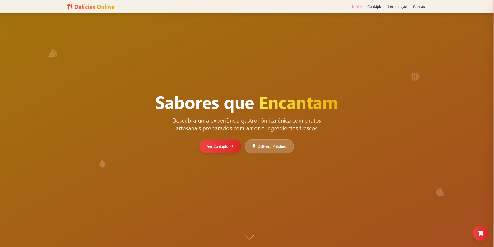
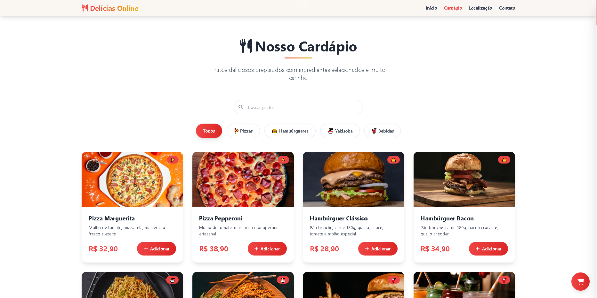
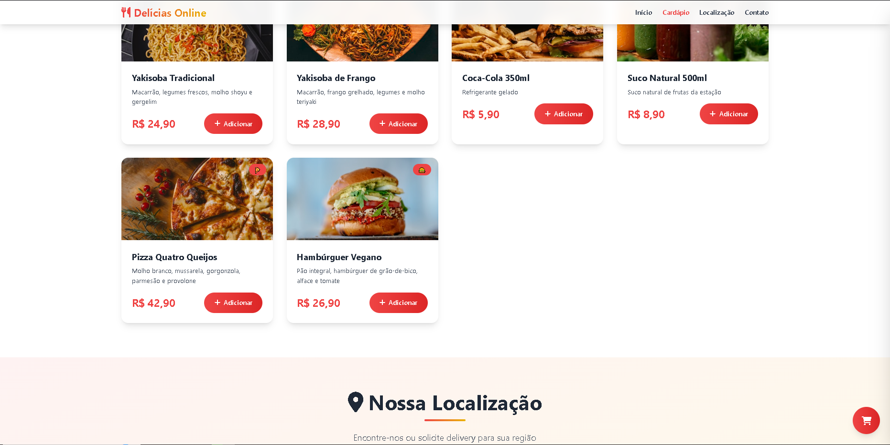
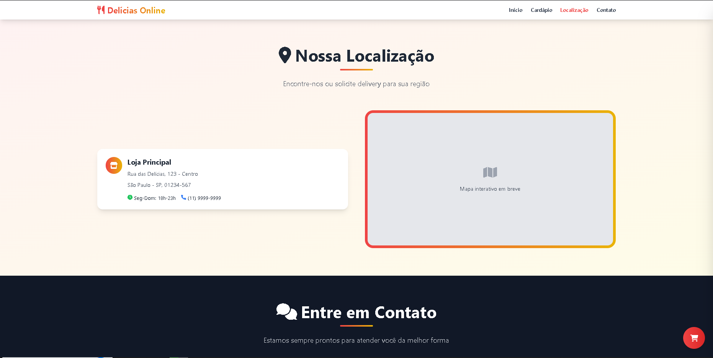
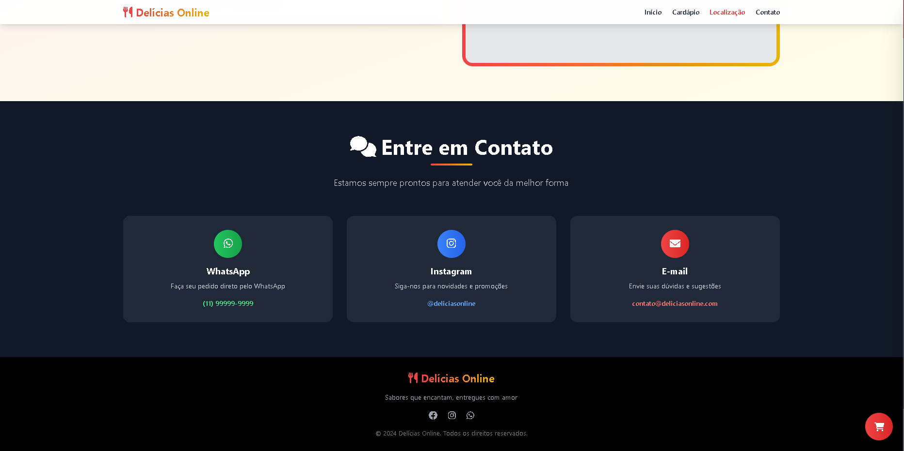

# 🍽️ Delícias Online - Sistema de Delivery de Comidas

Um sistema moderno e responsivo para delivery de comidas, desenvolvido com HTML, CSS (Tailwind CSS) e JavaScript. O projeto oferece uma experiência completa de pedidos online com integração ao WhatsApp.

## 📋 Sobre o Projeto

Este projeto é uma aplicação web completa para restaurantes e lanchonetes que desejam oferecer delivery online. O sistema permite que os clientes naveguem pelo cardápio, adicionem itens ao carrinho e finalizem pedidos diretamente pelo WhatsApp.

### 🎯 Objetivos do Projeto

- Criar uma interface moderna e intuitiva para pedidos online
- Implementar um sistema de carrinho de compras funcional
- Integrar com WhatsApp para facilitar a comunicação
- Oferecer uma experiência responsiva em todos os dispositivos

### 🛍️ Sistema de Produtos
- **Catálogo Dinâmico**: Exibição de produtos com imagens, descrições e preços
- **Filtros por Categoria**: Pizza, Hambúrguer, Yakisoba, Bebidas
- **Busca Inteligente**: Pesquisa por nome ou descrição dos produtos
- **Imagens Responsivas**: Com fallback automático para imagens indisponíveis

### 🛒 Carrinho de Compras
- **Adicionar/Remover Produtos**: Interface intuitiva para gerenciar itens
- **Controle de Quantidade**: Botões para aumentar/diminuir quantidades
- **Cálculo Automático**: Total atualizado em tempo real
- **Persistência de Dados**: Carrinho salvo no localStorage
- **Sidebar Animado**: Painel lateral com animações suaves

## 🛠️ Tecnologias Utilizadas

### Frontend

## 🎨 Capturas de Tela

## Contato:

<a href="https://www.linkedin.com/in/arthur-lima-027581326/" target="_blank">
